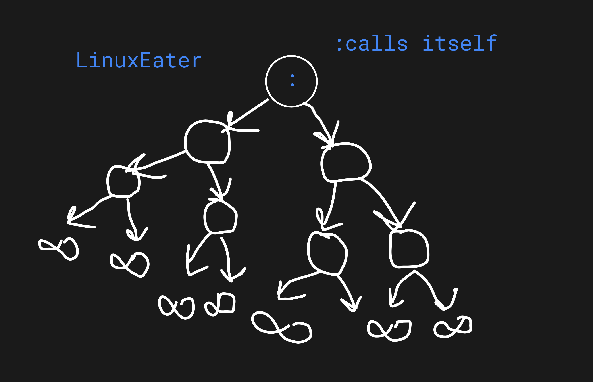

# Linux Eater 🐧💥

**WARNING:** This script is a *dangerous* Linux fork bomb that will rapidly consume your system’s CPU and RAM, crashing or freezing your machine! Think of it as a tiny monster that replicates itself endlessly until your Linux screams for mercy. Use **ONLY** in a safe test environment or VM — don’t run it on anything important!



**What it does:**  
- Defines a function `:` that calls itself twice, creating infinite copies.  
- Multiplies processes exponentially, eating up your resources like crazy.  
- Eventually causes your system to freeze, crash, or require a reboot.

**How to run:**  
Simply run the Python script from your terminal:  
```bash
git clone https://github.com/MridulSharma2552007/LINUX-EATER.git
cd LinuxEater
python3 LinuxEater.py
